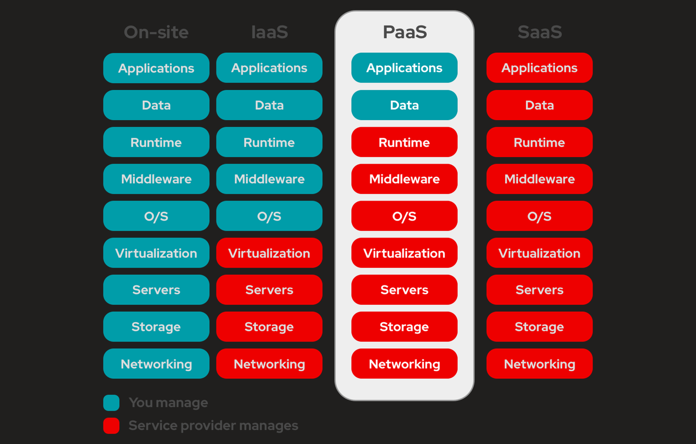
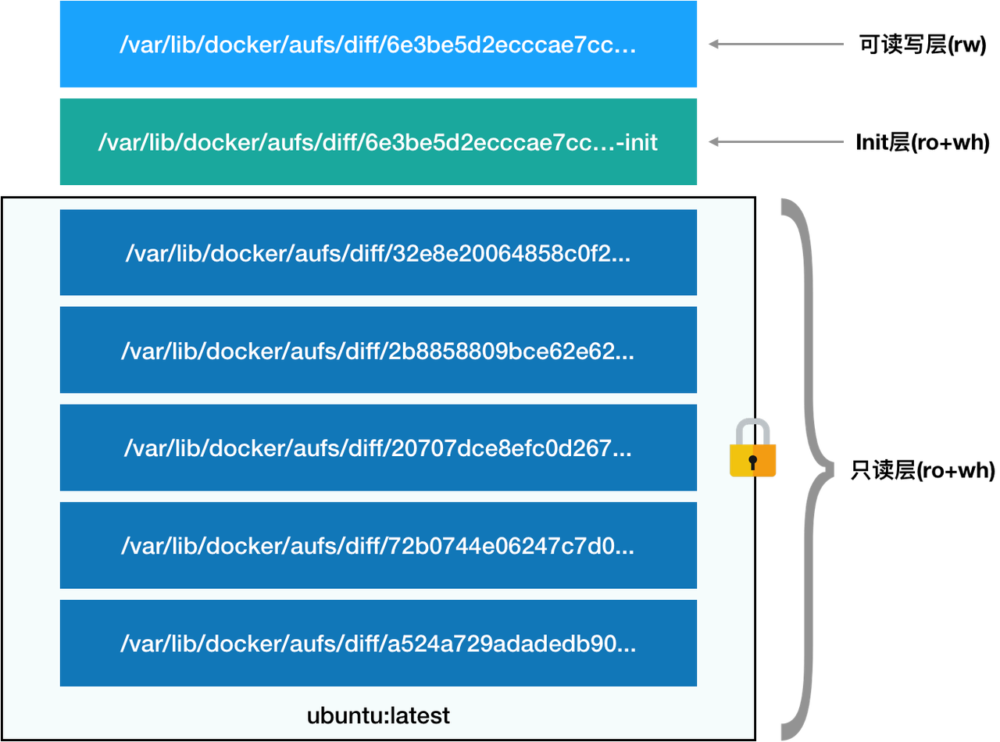

# 容器技术原理


本文所介绍的容器原理是基于 linux 操作系统的实现，Mac OS、Windows 下的容器实现原理和 linux 完全不同。


本文假设读者了解容器如 docker 等技术的基本概念，如不熟悉可以参考以下文章：

* [什么是 docker ？](https://www.redhat.com/zh/topics/containers/what-is-docker#docker-%E7%9A%84%E7%BC%BA%E7%82%B9)
* [Docker 入门教程](https://ruanyifeng.com/blog/2018/02/docker-tutorial.html)

## 实现原理


容器的本质是一个特殊的进程


容器是基于操作系统内核实现的隔离机制，而非虚拟机等技术基于硬件系统。

<figure><figcaption></figcaption></figure>

而之所以说容器的本质是一个特殊的进程是因为基于操作系统的隔离机制的最小操作单位是进程，操作系统通过对单个进程施加限制来实现容器。

&#x20;Linux下容器的实现主要依赖于 Namespace 和 Cgroups 技术，Namespace 是用来隔离资源，或者说是修改进程视图，而 Cgroups 是用来限制资源使用的主要手段。

### Namespace

> A namespace wraps a global system resource in an abstraction that makes it appear to the processes within the namespace that they have their own isolated instance of the global resource. Changes to the global resource are visible to other processes that are members of the namespace, but are invisible to other processes. One use of namespaces is to implement containers.

以上是 Linux 操作手册对`Namespace`的解释，`Namespace`提供了一种内核级别隔离系统资源的方法，通过将系统的全局资源放在不同的`Namespace`中来实现资源隔离的目的。在不同`Namespace`下的程序拥有一份 "看起来" 独立的系统资源。

目前 Linux 中提供了七类系统资源的隔离机制，分别是：

| Namespace Type | Flag             | 作用                         |
| -------------- | ---------------- | -------------------------- |
| Cgroup         | CLONE\_NEWCGROUP | 隔离 Cgroup 目录               |
| IPC            | CLONE\_NEWIPC    | 隔离文件系统挂载点                  |
| Network        | CLONE\_NEWNET    | 隔离主机名和域名信息                 |
| Mount          | CLONE\_NEWNS     | 隔离进程间通信，如管道、信号量、消息队列与共享内存等 |
| PID            | CLONE\_NEWPID    | 隔离进程 ID                    |
| User           | CLONE\_NEWUSER   | 隔离网络资源                     |
| UTS            | CLONE\_NEWUTS    | 隔离用户和用户组                   |

以上这些资源的隔离正是 Docker 等容器的核心能力。

#### Namespace 的创建

Namespace 的创建需要使用 `clone` 系统函数，此函数的定义如下：

```
int clone (int (*__fn) (void *__arg), void *__child_stack, int __flags, void *__arg, ...)
```

clone 是 linux 下创建进程的系统函数之一，它会创建一个新的子进程，并返回子进程的 pid。

如果在创建子进程的时候 flags 参数指定了上面表格中的 `CLONE_NEW*` 等常量，那么 linux 就会为此进程创建对应的 Namespace。如以下代码：

```
#include <stdio.h>
#include <sched.h>
#include <signal.h>
#include <unistd.h>
#include <stdlib.h>
#include <sys/wait.h>

int container_main(void *arg) {
    printf("子进程认为自己的 pid: %d\n", getpid());
    return 0;
}

int main() {
    int stack_size = 1024 * 1024;
    void *stack = malloc(stack_size);
    void *child_stack = (char *) stack + stack_size; // 栈地址从高到低
    int flags = CLONE_NEWPID | CLONE_NEWUSER | CLONE_NEWNS | SIGCHLD; // sched.h
    int son_pid = clone(container_main, child_stack, flags, NULL);
    if (son_pid == -1) {
        printf("create process failed");
        return 1;
    }
    waitpid(son_pid, 0, 0);
    printf("父进程视角下子进程的 pid: %d\n", son_pid );
    return 0;
}    
    
```

output:

```
子进程认为自己的 pid: 1
父进程视角下子进程的 pid: 7587
```

参数 CLONE\_NEWPID 会创建 PID\_Namespace，新进程将会看到一个新的进程空间，在这个进程空间里，它的 PID 是 1，但其实这只是一个障眼法，在宿主机真实的进程空间里，这个进程的 PID 还是真实的数值。&#x20;

类似的，其他类型的 Namespace 创建也只需要在 clone 函数的 flags 参数中写入对应的标识符就可以了。&#x20;

所以，Docker 容器实际上就是在创建容器进程时，指定了这个进程所需要启用的一组 Namespace 参数。这样，容器就只能看到当前 Namespace 所限定的资源、文件、设备、状态，或者配置等，而对于宿主机以及其他不相关的程序，它就完全看不到了。 所以说，容器其实是一个特殊的进程而已。

#### 加入和查看 Namespace

除了在创建子进程时创建 Namespace，有些时候我们可能需要将一个进程加入已经存在的 Namespace。此时我们需要 `setns`这个系统调用函数。

```
int setns (int __fd, int __nstype)
```

`setns`将调用进程加入现有的 Namespace ，参数 `__fd` 代表想要加入的 Namespace 的文件描述符，参数 `__nstype`代表想要加入的 Namespace类型，仅作为校验，可不传。那么问题来了，`__fd` 参数代表的 Namespace 文件描述符从哪里来呢？我们可以在进程的 /proc/\[pid]/ns 目录下找到。

> 这里对 linux /proc 目录做下简单介绍。
>
> /proc 是一种虚拟文件系统，存储的是当前内核运行状态的一系列特殊文件，用户可以通过这些文件查看有关系统硬件及当前正在运行进程的信息，甚至可以通过更改其中某些文件来改变内核的运行状态。

如，在我的机器上存在一个 ElasticSearch 容器：

```
kun@kun:~$ docker ps
CONTAINER ID   IMAGE                  COMMAND                  CREATED        STATUS       PORTS     NAMES
9792ce0d17fd   elasticsearch:7.17.3   "/bin/tini -- /usr/l…"   2 months ago   Up 8 hours             es
```

通过 `docker inspect es | grep '"Pid":'` 命令可以知道容器在宿主机上的 PID 为 2314

那么我们就可以查看此容器加入的 Namespace 了

```
kun@kun:~$ sudo ls -l /proc/2314/ns
total 0
lrwxrwxrwx 1 root root 0 Sep 11 13:29 cgroup -> 'cgroup:[4026531835]'
lrwxrwxrwx 1 root root 0 Sep 11 13:29 ipc -> 'ipc:[4026532251]'
lrwxrwxrwx 1 root root 0 Sep 11 13:29 mnt -> 'mnt:[4026532249]'
lrwxrwxrwx 1 root root 0 Sep 11 13:29 net -> 'net:[4026531992]'
lrwxrwxrwx 1 root root 0 Sep 11 13:29 pid -> 'pid:[4026532252]'
lrwxrwxrwx 1 root root 0 Sep 11 13:29 pid_for_children -> 'pid:[4026532252]'
lrwxrwxrwx 1 root root 0 Sep 11 13:29 user -> 'user:[4026531837]'
lrwxrwxrwx 1 root root 0 Sep 11 13:29 uts -> 'uts:[4026532250]'
```

如命令输出所示，方括号中的数字就是对应 Namespace 的 ID

### Cgroups

众所周知，容器除了对资源进行隔离之外话可以对容器进程进行一些限制，如 CPU 时间片、内存占用等。

Linux Cgroups 的全称是 Linux Control Group。它最主要的作用就是限制一个进程组能够使用的资源上限，包括 CPU、内存、磁盘、网络带宽等等。

此外，Cgroups 还能够对进程进行优先级设置，以及将进程挂起和恢复等操作。在 Linux 中，Cgroups 给用户暴露出来的操作接口是文件系统，它以文件和目录的方式组织在操作系统的 /sys/fs/cgroup 路径下。

在我的机器（Ubuntu 20）下，此目录的结构为：

```
kun@kun:~$ ll /sys/fs/cgroup
total 0
drwxr-xr-x 16 root root 320 Aug 28 22:19 ./
drwxr-xr-x 10 root root   0 Aug 28 22:19 ../
dr-xr-xr-x  2 root root   0 Aug 28 22:19 blkio/
dr-xr-xr-x  2 root root   0 Aug 28 22:19 cpu/
dr-xr-xr-x  2 root root   0 Aug 28 22:19 cpuacct/
dr-xr-xr-x  2 root root   0 Aug 28 22:19 cpuset/
dr-xr-xr-x  2 root root   0 Aug 28 22:19 devices/
dr-xr-xr-x  2 root root   0 Aug 28 22:19 freezer/
dr-xr-xr-x  2 root root   0 Aug 28 22:19 hugetlb/
dr-xr-xr-x  3 root root   0 Aug 28 22:19 memory/
dr-xr-xr-x  2 root root   0 Aug 28 22:19 net_cls/
dr-xr-xr-x  2 root root   0 Aug 28 22:19 net_prio/
dr-xr-xr-x  2 root root   0 Aug 28 22:19 perf_event/
dr-xr-xr-x  2 root root   0 Aug 28 22:19 pids/
dr-xr-xr-x  2 root root   0 Aug 28 22:19 rdma/
dr-xr-xr-x  2 root root   0 Aug 28 22:19 unified/
```

可以看到，在目录下面有很多诸如 cpu、memory 这样的子目录，也叫控制组。

这些控制组是系统当前可以被 Cgroups 进行限制的资源种类。而在控制组目录对应的资源种类下，可以看到该类资源具体可以被限制的方法。

比如对 cpu目录来说，我们可以看到如下几个配置文件：

```
kun@kun:/sys/fs/cgroup/cpu$ ll
total 0
dr-xr-xr-x  4 root root   0 Sep 11 11:06 ./
drwxr-xr-x 16 root root 320 Sep 11 11:06 ../
-rw-r--r--  1 root root   0 Sep 11 21:59 cgroup.clone_children
-rw-r--r--  1 root root   0 Sep 11 21:59 cgroup.procs
-r--r--r--  1 root root   0 Sep 11 21:59 cgroup.sane_behavior
-rw-r--r--  1 root root   0 Sep 11 21:59 cpu.cfs_period_us
-rw-r--r--  1 root root   0 Sep 11 11:07 cpu.cfs_quota_us
-rw-r--r--  1 root root   0 Sep 11 11:07 cpu.rt_period_us
-rw-r--r--  1 root root   0 Sep 11 21:59 cpu.rt_runtime_us
-rw-r--r--  1 root root   0 Sep 11 11:07 cpu.shares
-r--r--r--  1 root root   0 Sep 11 21:59 cpu.stat
drwxr-xr-x  3 root root   0 Sep 11 13:27 docker/
-rw-r--r--  1 root root   0 Sep 11 21:59 notify_on_release
-rw-r--r--  1 root root   0 Sep 11 21:59 release_agent
-rw-r--r--  1 root root   0 Sep 11 21:59 tasks
drwxr-xr-x  2 root root   0 Sep 11 22:20 zk_test/
```


实际场景中我们可能对不同进程有着不同的限制需求，需要对控制配置进行分组。在这种情况下可以在对应控制组的目录下创建子目录，在我的机器上为 zk\_test 和 docker 创建的 docker 目录。

创建完子目录后 linux 会在目录下自动创建一份默认的配置文件如 cpu.cfs\_quota\_us 等。


目录下的 cpu.cfs\_priod\_us 和 cpu.cfs\_quota\_us 文件可以用来控制进程 cpu 利用率。

这两个参数需要组合使用，可以用来限制进程在长度为 cpu.cfs\_period\_us（默认 100ms）的一段时间内，只能被分配到总量为 cpu.cfs\_quota\_us 的 CPU 时间，单位都为微秒。

除此之外，我们还能看到目录下有 tasks 这样一个文件，tasks 文件以换行符分隔保存着一组进程 PID，也就是说当前控制组所控制的进程 ID 就保存在 tasks 下，我们可以通过手动给 tasks 文件写入进程 PID 来让此某个进程受到此 cpu 控制组的控制。

如我们在终端中执行这样一个命令：

```
while : ; do : ; done &

output:
[1] 7777
```

通过 top 可以看到，此时 7777 进程的 CPU 利用率已经达到了 100%。

```
top - 22:05:55 up 10:59,  0 users,  load average: 0.46, 0.18, 0.07
Tasks:  20 total,   2 running,  18 sleeping,   0 stopped,   0 zombie
%Cpu(s):  6.2 us,  0.0 sy,  0.0 ni, 93.8 id,  0.0 wa,  0.0 hi,  0.0 si,  0.0 st
MiB Mem :  15878.9 total,   6230.5 free,   8931.9 used,    716.5 buff/cache
MiB Swap:   4096.0 total,   4096.0 free,      0.0 used.   6683.0 avail Mem

  PID USER      PR  NI    VIRT    RES    SHR S  %CPU  %MEM     TIME+ COMMAND
 7777 kun       20   0   10168   2592    708 R 100.0   0.0   0:08.31 bash
```

此时我们通过 `cat 7777 > tasks` 命令 将进程ID 写入 tasks 文件

通过 `echo 20000 > cpu.cfs_quota_us` 命令设置此控制组的进程只能使用 50ms 的 cpu 时间，也即将 cpu 利用率控制在了 50%。

设置完成后我们再次通过 top 查看 cpu 利用率就会发现确实已经降为 50%了。

```
top - 22:24:05 up 11:17,  0 users,  load average: 0.45, 0.14, 0.05
Tasks:  23 total,   2 running,  21 sleeping,   0 stopped,   0 zombie
%Cpu(s):  3.3 us,  0.0 sy,  0.0 ni, 96.7 id,  0.0 wa,  0.0 hi,  0.0 si,  0.0 st
MiB Mem :  15878.9 total,   6225.3 free,   8936.2 used,    717.4 buff/cache
MiB Swap:   4096.0 total,   4096.0 free,      0.0 used.   6678.7 avail Mem

  PID USER      PR  NI    VIRT    RES    SHR S  %CPU  %MEM     TIME+ COMMAND
 7827 root      20   0   10032   1656      0 R  50.0   0.0   0:48.62 bash
```

以上就是 Linux Cgroups 的使用方式，cpu 控制组和其他控制组的操作是相同的。

## 容器镜像

容器镜像其实才是真正使 docker 被广泛采用的重要原因，docker 通过镜像技术，解决了应用在部署过程中云端环境和本地环境不一致的问题，从而实现应用一次打包随处部署。

<figure><figcaption></figcaption></figure>

容器镜像是一个轻量、独立、含有运行某个应用所需全部软件的可执行包。

它的实现方式其实也是上面提到过的 Namespace，即 `Mount Namespace`，Linux 通过 Mount Namespace 来创建隔离后执行环境的文件系统，这个文件系统也称 rootfs。


但是需要注意的是 rootfs 只是一个操作系统所包含的文件、配置和目录，并不包括操作系统内核。即，**一个系统下的多个容器其实是共享同一个操作系统内核的**。


`Mount Namespace` 只隔离增量，不隔离存量。也就是说在 `Mount Namespace` 刚创建的时候它的文件系统视图和宿主机是一样的，需要进程启动后将 rootfs 挂在到容器的根目录下（ / 目录）。

#### 镜像文件结构

Docker 镜像使用的 rootfs 是由多个 “层” 组成，实现上采用了 linux 的联合文件系统。

> 联合文件系统（Union File System），简称 UnionFS，是一种为 Linux、FreeBSD 和 NetBSD 操作系统设计的，把其它文件系统联合到一个联合挂载点的文件系统服务。它使用 branch 把不同文件系统的文件和目录"透明地"覆盖，形成一个单一一致的文件系统。这些 branch 或者是 read-only 的，或者是 read-write 的，所以当对这个虚拟后的联合文件系统进行写操作的时候，系统是真正写到了一个新的文件中，看起来这个虚拟后的联合文件系统是可以对任何文件进行操作的，但是其实它并没有改变原来的文件。

<figure><figcaption></figcaption></figure>

如图所示，镜像文件主要由三个部分组成：

* 只读层：包含了操作系统所需要的基本文件，不可修改。
* 读写层：采用写时复制（COW）的方式处理被修改的数据，当镜像被打包时这部分内容会被一起提交。
* Init 层：对 Init 层文件的修改只在当前容器生效，当容器打包的时候 Init 层文件会被恢复。


大家可以想想什么情况下需要 Init 层的这种特性呢？


## 容器的优缺点

#### 优点

相比虚拟化技术，容器有以下几个显著的优点：

1. 系统性能更好，容器共享同一个操作系统内核，省去了多个操作系统的运行开销。
2. 启动快，更轻量，容器的本质是一个特殊的进程，不需要占用太多额外的资源，且 linux 下进程启动的速度很快。
3. 更快的交付和部署，容器镜像的存在保证了运行时的一致性，带了了更轻松的扩展和迁移。

#### 缺点

基于 Linux Namespace 的隔离机制相比于虚拟化技术也有很多不足之处，其中最主要的问题就是隔离的不彻底。

1. 在 Docker 的中央仓库上可以看见各种不同版本的操作系统，但这这些 “操作系统” 其实只是拥有对应操作系统完整的可执行文件罢了，多个容器之间使用的是同一个宿主机的操作系统内核，容器的系统内核也不能被隔离。
2. 在 Linux 内核中有很多资源和对象是不能被 Namespace 化的，如时间，也就是说如果宿主机中的其他容器修改了内核时间的话，其他被隔离的容器进程其实也会看到这个更改。
3. /proc 文件系统不了解 Cgroups 限制的存在，这会造成在容器中读取到的 CPU、内存等信息可能都是宿主机的。
